# Capturing screenshots of browser-based demos using VLC

By [cxw]/[Incline]

## Intro

[Demozoo] is looking for screenshots of browser-based demoscene releases!
You can capture your favorite moments in demos using the free [VLC] media
player and recorder.  I will walk you through the capture process
and show you how to upload the resulting images to Demozoo.

All of the programs I use can run on Linux, Mac, or Windows, and probably
other Unix-like OSes.  I tested the steps for this article on Windows.

There are a lot of steps, but they all take longer to describe than to
actually do!  Remember: Demozoo [supports](https://demozoo.org/forums/7/)
high-res images and multiple screenshots, so you can go wild!

## Initial setup

1. Download and install a desktop version of [VLC].  It supports
   Windows, Mac, and Linux.  (I used VLC version 3.0.8.)
1. Open VLC.
1. On the `Tools` menu, select `Preferences`.
1. (see screenshot) (1) Click on `Hotkeys`,
   (2) type "snapshot" in the `Search` box,
   and make note of the "Global" hotkey for `Take video snapshot`.
   This is the key you will press while the demo is running to save a
   screenshot.  In my case, it is `Alt`+`F12`.

   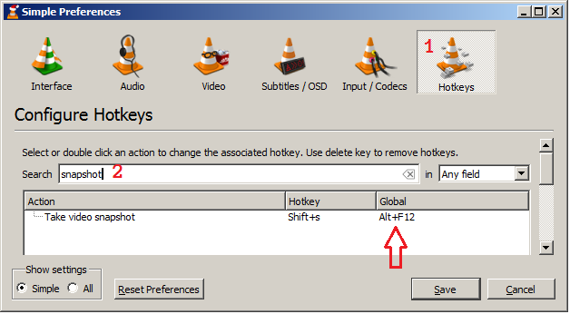

1. Install at least two browsers.  Some demos only run on Chrome or only
   on Firefox, so have several available.

1. Install [GIMP].  You will use it to bulk-crop the images in the
   "Post-processing" section, below.  If you already have a program
   that will crop multiple image files, you can skip this step.
1. Download the Export Layers GIMP plugin by khalim19 from
   [here](https://github.com/khalim19/gimp-plugin-export-layers/releases/latest).
1. Install the Export Layers GIMP plugin usingper the instructions
   [here](https://khalim19.github.io/gimp-plugin-export-layers/sections/Installation.html).
1. (Optional; recommended) Install my layernav plugin as described
   in "layernav.py", below.

## Setting up to VLC capture a demo

1. Open VLC.
1. On the `Media` menu, select `Open Capture Device...`.
1. (see screenshot) (1) Select the `Capture Device` tab.
   (2) Change the `Capture mode` to `Desktop` (i.e., your screen).
   (3) Pick a frame rate for the capture.  Lower rates will make the demo
   perform better, but will make the screenshots lag the hotkey press.
   Start with 5 f/s (frames per second) and see if that works for you.
   (4) Click the downward-pointing arrow next to the `Play` button.
   (5) Choose `Enqueue` from the drop-down menu.

   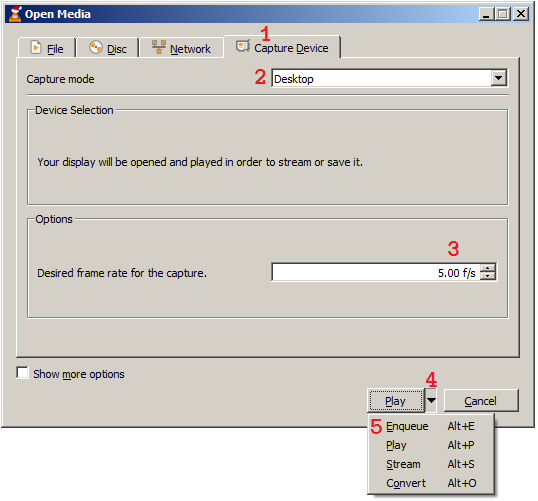

1. You will see a `screen://` entry in your playlist.  When you are
   ready to go, you will double-click that entry to start capturing.

   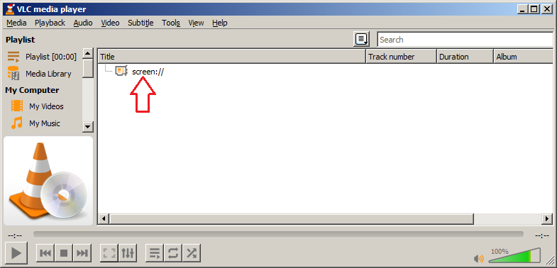

## Setting up the demo

Get the demo running on your PC!  This will vary by demo.

- [Conduit] by Gargaj may help you with this.
- You can also check the `README` or `FILE_ID.DIZ` included with a
  demo to see what it runs on.  For example, [Voltra]'s `FILE_ID.DIZ`
  suggests Chromium and Edge.

**Note**: if you only have one monitor, make sure you can run the demo
in windowed mode, not full-screen.  That will make it much easier to
interact with VLC while the demo is running.

You may need to change your browser settings to permit Web pages to
auto-play sound in order for the demo to start.

Once you are able to run the demo in one window, with VLC open in
another window, you are ready to take screenshots.

## Capturing!

1. Back in VLC, double-click the `screen://` entry.  You will see your
   desktop appear in VLC:

   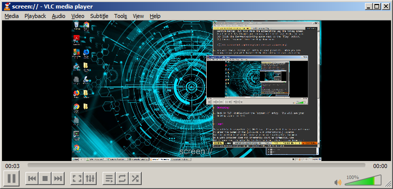

1. Minimize VLC so you don't get an infinite tunnel :) .
1. Start the demo.
1. At &mdash; or just before &mdash; a part you want to take a
   screenshot of, hit the hotkey you noted above (`Alt`+`F12` for me).

   - You will only get feedback in the VLC window, so you won't know
     that the capture has succeeded if VLC is minimized.  Don't worry:
     the image will still have been captured.

1. Hit the hotkey multiple times for as many screenshots as you want to take!
1. When the demo is over, go back to VLC.  Wait a few seconds to make
   sure it's finished processing screenshots, then hit the square Stop button
   at the bottom of the VLC window.

   - You will know it's still processing if you see screenshot frames
     appearing in the upper-left corner of the image, or if you see
     text overlays like "vlcsnap.png".

## Post-processing

If you have a multi-monitor system or ran the demo windowed, you will
need to trim the screenshots to show just the demo content.  If you
were able to run the demo in full-screen mode on a single monitor, you
may be able to skip this section.

1. Open GIMP.
1. On the `File` menu, select `Open as layers...`.
1. Navigate to the `Pictures` folder, or wherever VLC saves
   screenshots on your platform.
1. (see screenshot) Click the first `vlcsnap` file, scroll to the end,
   and shift-click the last `vlcsnap` file:

   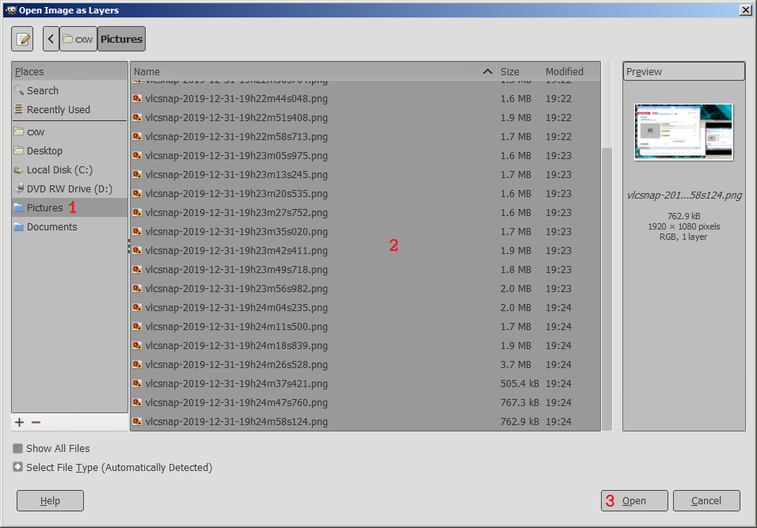

   From this point, anytime you save a GIMP (`.xcf`) file, it will
   save all of your screenshots in that one file.

1. On the `Layers` menu, select `Stack`, then select
   `Reverse Layer Order` from the pop-out menu.  This will put the
   first screenshot first rather than last.

1. (see screenshot) (1) Click on the `Layers` tab to make the Layers
   pane visible.  (If you can't see the `Layers` tab, go to the
   `Windows` menu, select `Dockable Dialogs`, then select `Layers` in the
   pop-out menu.)  You will see all your `vlcsnap` files listed.
   (2) If any vlcsnaps aren't screenshots of the demo, or if you don't
   want to upload them, (2) click on them in the `Layers` box and
   (3) click the "X" to delete them.

   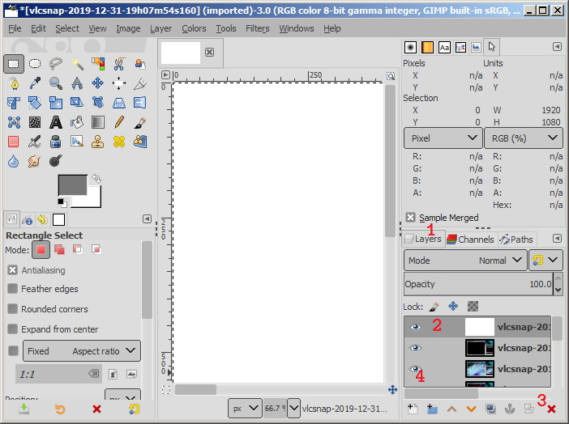

   To see only one layer, (4) click on the eye icons on all the other
   layers to turn them off, so that only the layer you want to see has
   an eye icon visible.  For an easier way to navigate the layers,
   see "layernav.py", below.

1. (see screenshot) (1) Click on the rectangle-select tool in the
   toolbox.  (2) Draw a selection rectangle around the area of the
   demo.

   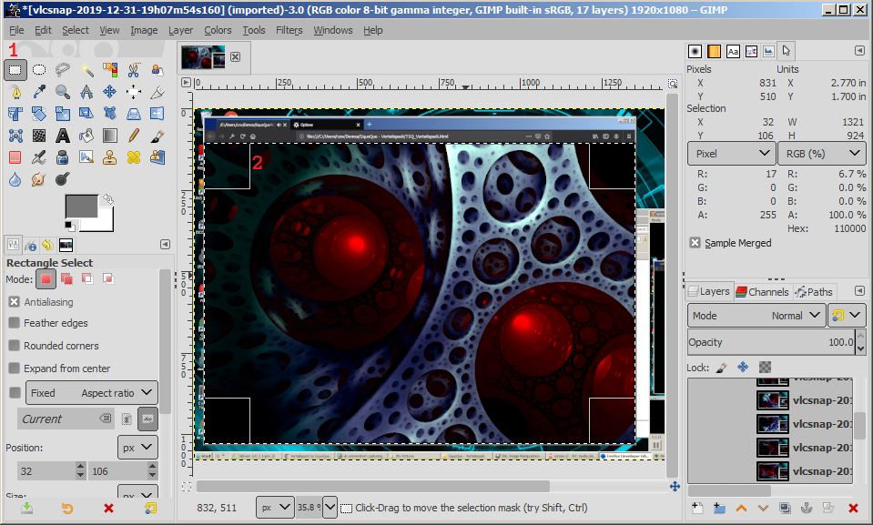

   I recommend zooming in on the top-left corner, starting the
   selection, zooming out, moving the bottom-right corner of the
   selection close to where you want it, then zooming in to finish
   the bottom-right corner.  You can zoom with `Ctrl`+mouse wheel
   (on Windows).

   In GIMP, you can use Undo if you change the selection in a way you
   don't want.

1. On the `Image` menu, select `Crop to selection`.  That will crop
   all the screenshots (all the layers) at once.

1. On the `File` menu, select `Export Layers...`.
1. (see screenshot) (1) Click `Create Folder`.  (2) Give the folder a
   name.  I used the name of the demo ([Vorteilspack]).  Hit Enter to
   create the folder.  Double-click on the folder to open it.
   (3) Click `Export`.

   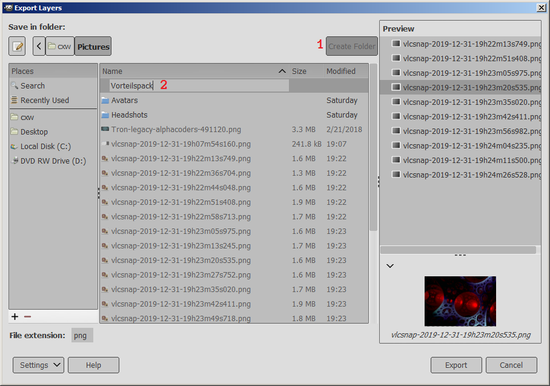

1. You will see an `Export Image as PNG` dialog.  Hit Export in that
   dialog.  You will see the progress bar at the bottom of the VLC
   window repeatedly fill while the images are exported.

   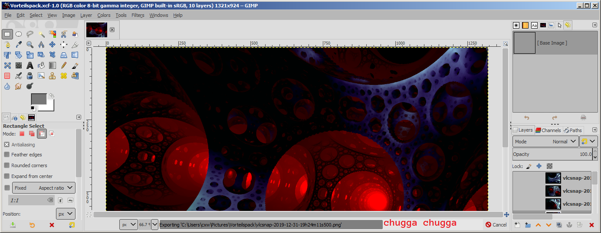

## Uploading images to Demozoo

Finally!

1. In the browser, go to the page for the production you have
   screenshots for.

1. If there are no screenshots, click `Add one`:

   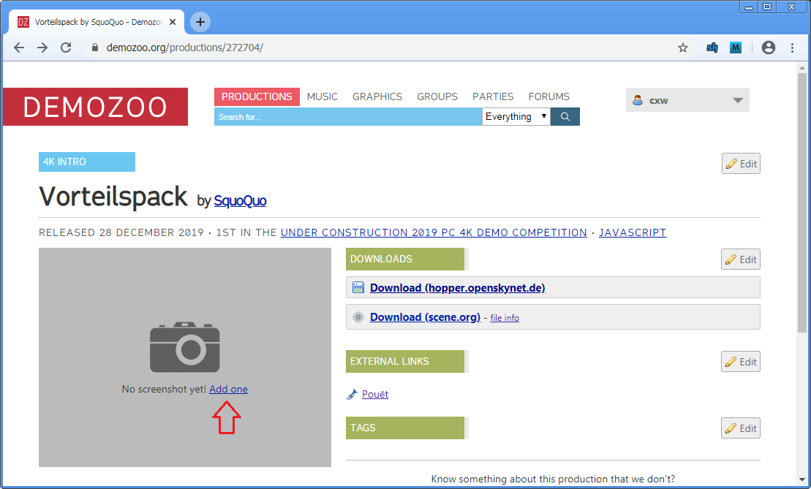

   Otherwise, click `Add screenshot` below the existing screenshots:

   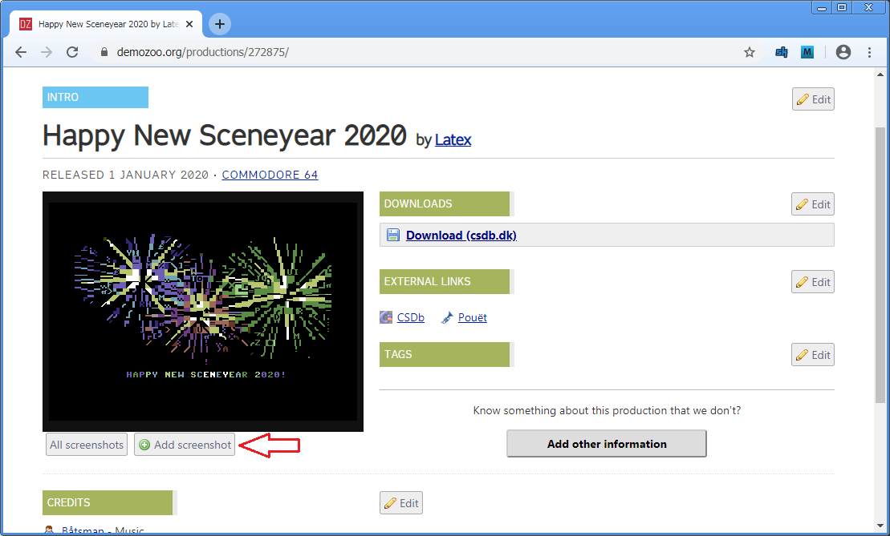

1. (see screenshot)
   (1) Click `Choose Files` and select your images.  Alternatively,
   drag and drop your images onto the `Choose Files` button.
   **Note**: the total file size should be under 10 megabytes.
   (2) You will see the number of files to be uploaded.
   Make sure it matches what you expect.
   (3) Click `Submit`.

   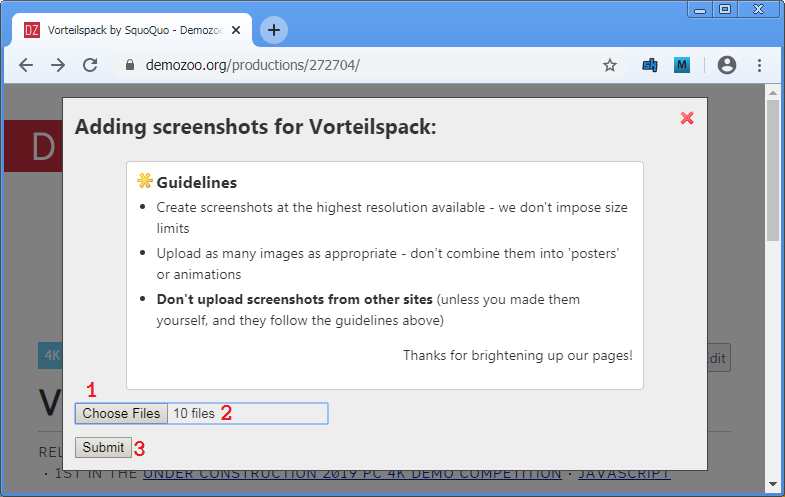

1. Wait for the upload!

   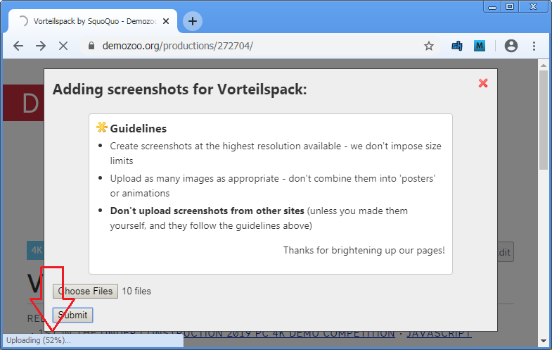

   If you get a `413` error, try again with fewer files at once.
   I think the limit is 10M, but am not sure
   ([question pending answer](https://demozoo.slack.com/archives/C0H2K05LP/p1577850433087700)).

   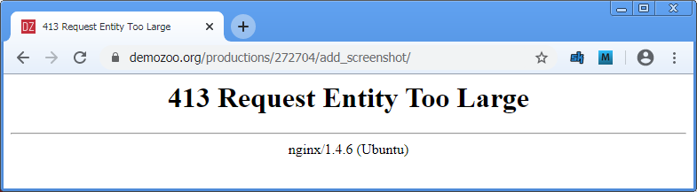

1. Bask in the glory of the page with screenshots, and in the glow of
   the knowledge that you have helped the scene!

   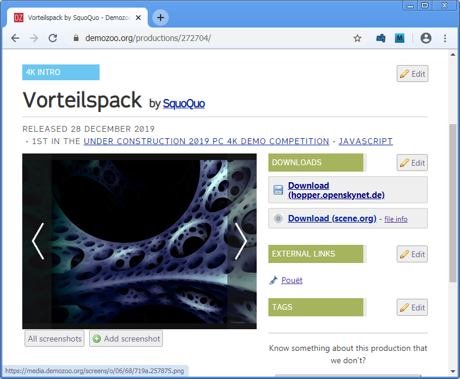

## Addendum: layernav.py

I wrote a GIMP plugin to make it easier to navigate between layers.
To use it:

### Installation (one-time)

1. Download [layernav.py]
1. Copy layernav.py to your GIMP plugins directory.  For GIMP 2.8,
   that is probably `.gimp-2.8` in your home directory.  For GIMP
   2.10, it is probably :

   - Linux or other Unix-like: `~/.config/GIMP/2.10/plug-ins`
   - Windows: `%APPDATA%\GIMP\2.10\plug-ins`
   - Mac: `~/Library/Application Support/GIMP/2.10/plug-ins`

   This
   [MakeUseOf article](https://www.makeuseof.com/tag/install-gimp-plugins/)
   (by Andy Betts) may help you.

1. Restart GIMP.
1. On the `Edit` menu, select `Keyboard Shortcuts`.
1. (see screenshot) (1) in the `Search` box, type "layernav".
   (2) Next to `Show next layer`, click on the word `Disabled`.
   Press a hotkey &mdash; I use `Ctrl`+`Shift`+`Page Down`.
   (3) Do the same for `Show previous layer`.
   I use `Ctrl`+`Shift`+`Page Up`.
   (4) Press `Close`.

   

### Usage

When you have an image open, press the hotkeys you chose to navigate
between layers.  If no layer is visible, the plugin will take you to
the first layer.

## Legal

This article is copyright (c) 2019 cxw.  Please feel free to use and share
it under the terms of the [CC-BY-NC 4.0 International] license.
For the avoidance of doubt, merely using or sharing this document
on a work computer does not inherently count as commercial use.
But if your day job actually involves scening, please let me know so I
can apply :) .

### Thanks to

- a [PC Tonic article](https://pctonic.net/use-vlc-as-a-screen-recording-tool/)
  for helping me get started with capturing in VLC
- Alpha Coders for my
  [desktop wallpaper](https://wall.alphacoders.com/big.php?i=491120),
  by AlphaEdifice6083.

I am not affiliated with any of those parties.

- [menace] for the opportunity to write this article!

[CC-BY-NC 4.0 International]: http://creativecommons.org/licenses/by-nc/4.0/
[Conduit]: https://github.com/Gargaj/Conduit
[cxw]: https://demozoo.org/sceners/65996/
[Demozoo]: https://demozoo.org
[GIMP]: https://www.gimp.org/downloads/
[Incline]: https://demozoo.org/groups/65997/
[layernav.py]: https://raw.githubusercontent.com/cxw42/cxw42.github.io/master/layernav.py
[menace]: https://demozoo.org/sceners/93/
[VLC]: https://videolan.org/vlc/
[Voltra]: https://files.scene.org/view/parties/2017/assembly17/1k/voltra_by_ribbon.zip
[Vorteilspack]: https://demozoo.org/productions/272704/
